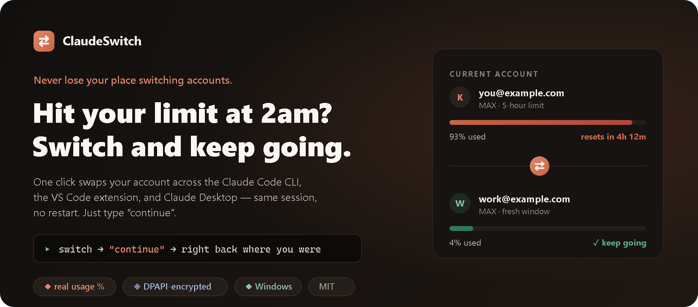
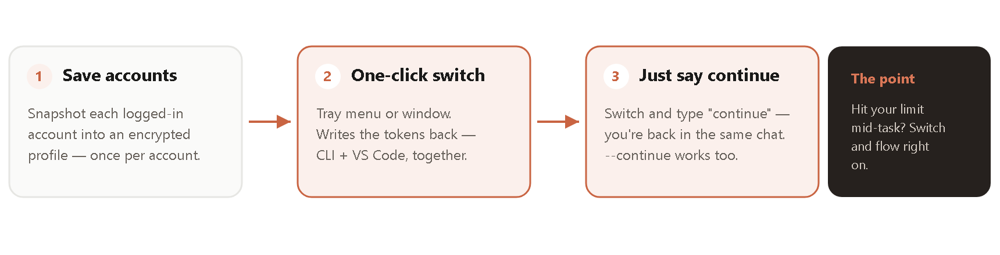
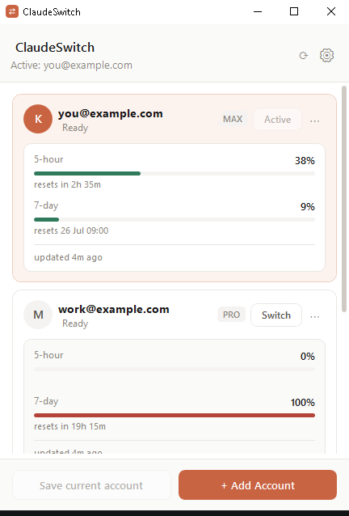
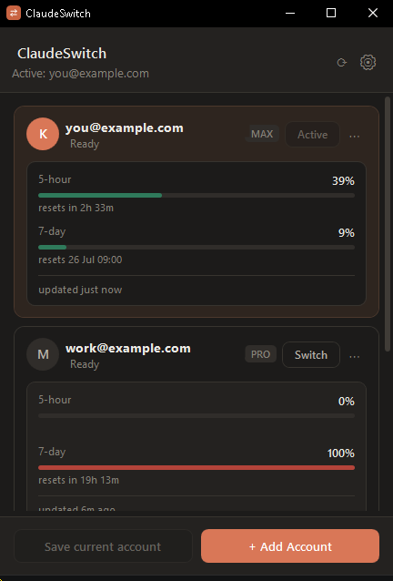

<p align="center">
  
</p>

<p align="center">
  <b>One-click account switching for Claude Code — CLI and the VS Code extension at the same time.</b><br>
  Hit your usage limit mid-task? Switch accounts from the tray and <b>pick up the exact same conversation</b>.
</p>

<p align="center">
  
  
  
  
</p>

---

## Why this exists

Antigravity lets you flip between accounts in one click. Claude Code doesn't — switching means
logging out, logging back in, and losing your place. **ClaudeSwitch brings that one-click flow to
Claude Code**, and adds the thing that actually matters day-to-day:

> ### 🌟 Switch mid-conversation and just say "continue"
> You're deep in a conversation in VS Code and you hit your 5-hour limit. Switch accounts from the
> tray, go back to the *same open session*, and type **"continue"** — you're right back where you
> were, now on the fresh account. Claude Code reads the new credentials on your next message, so
> that's all it takes.
>
> Prefer to be explicit? `claude --continue` resumes the same conversation too — it works either way,
> because transcripts live on disk per-project, independent of which account is signed in. However you
> do it, you never lose your place. **This is the feature that sets ClaudeSwitch apart.**

<p align="center">
  
</p>

<table align="center">
  <tr>
    <td align="center"></td>
    <td align="center"></td>
  </tr>
  <tr>
    <td align="center"><sub>Light theme</sub></td>
    <td align="center"><sub>Dark theme</sub></td>
  </tr>
</table>

<p align="center"><sub>Real usage %, live reset times · light & dark themes · 7 languages · compact mode</sub></p>

---

## One switch covers both surfaces

The Claude Code CLI and the VS Code extension don't keep separate logins — they read the **same two
files**:

| File | Holds |
|---|---|
| `~/.claude/.credentials.json` | OAuth tokens (`accessToken`, `refreshToken`, `expiresAt`, `subscriptionType`) |
| `~/.claude.json` | Account identity (`oauthAccount`, `userID`) and subscription caches |

ClaudeSwitch keeps an encrypted snapshot of these per account and writes them back on switch — so a
single click updates your terminal **and** your editor at once.

---

## Features

- **One-click switching** from a system-tray menu or the main window.
- **Real usage %** — genuine 5-hour and 7-day utilization with reset times, from the *same source*
  Claude Code's own `/usage` command uses. No guessed limits, no fabricated numbers.
- **Add accounts without signing out.** New logins run in an isolated, throwaway browser profile,
  so your current account is never touched and the login page actually asks *which* account to use.
- **Encrypted at rest.** Tokens are sealed with Windows DPAPI (current-user scope) — unreadable by
  other users on the machine, and non-portable to other machines.
- **Auto-switch at your limit.** When the active account hits its 5-hour limit, ClaudeSwitch can
  jump to the account with the most headroom automatically — so you never stop to fiddle. Optional.
- **Limit notifications & a colour-coded tray icon.** The tray icon goes green → amber → red with
  the active account's usage, and warns you before you get blocked.
- **"Most free" badge** highlights which saved account has the most quota left right now.
- **Usage trend sparkline** on each card, from the history collected in the background.
- **Ring-fence an account.** Mark a work or client seat "never auto-switch to this" so auto-switch
  and the hotkey can't drop you into it unattended.
- **Switch from one click.** Left-click the tray icon for the account list, with each account's
  5-hour percentage right there in the menu.
- **Optional Claude Code integration** — show the active account *inside* Claude Code's status
  line, and get told the instant a session is rate-limited (see [below](#inside-claude-code)).
- **Global hotkey** (`Ctrl+Alt+S`) cycles accounts from anywhere, and **Start with Windows** keeps
  it in your tray.
- **Auto-update check** notifies you when a newer release is out.
- **Light, dark, or follow Windows**, with a smooth crossfade when it changes — plus a **compact
  mode** that hides the usage panels for a denser list, per-account colours, a sort order that
  suits you, and a window that reopens where you left it.
- **7 languages** — English, Türkçe, Deutsch, Español, Français, Русский, 中文 — switchable on the fly.
- **Safe `~/.claude.json` edits.** Your project history, MCP servers, and settings are preserved
  byte-for-byte (see [below](#why-claudejson-is-handled-so-carefully)).
- **Automatic backups** before every switch (last 20 kept).
- **Low footprint.** A lightweight WPF tray app that trims its working set when minimized.

---

## Install

Grab a build from the [**Releases**](../../releases) page:

| File | When to use it |
|---|---|
| `ClaudeSwitch.exe` | Most people. The tray app, no prerequisites. |
| `ClaudeSwitch-lite.exe` | Tray app, if you already have the [.NET 8 Desktop Runtime](https://dotnet.microsoft.com/download/dotnet/8.0). |

They're portable single files — no installer. Unsigned, so SmartScreen may warn you: **More info →
Run anyway**.

> You need Claude Code installed and signed in at least once
> (`npm install -g @anthropic-ai/claude-code`).

### Build from source

```powershell
git clone https://github.com/keremerylmz/ClaudeSwitch
cd ClaudeSwitch
.\build.ps1 -SelfContained -Test
```

Requires the .NET 8 SDK. Output lands in `publish\ClaudeSwitch.exe`.

---

## Usage

1. **Save current account** — snapshots whoever is signed in right now into a profile.
2. **+ Add Account** — opens a private, session-free browser window straight on the login page, so
   you can sign in with a *different* account. ClaudeSwitch captures it automatically. *(Once per
   account; after that it's one click forever.)*
3. Right-click the tray icon and pick an account — or use the **Switch** button in the window.

> **You usually don't need to restart anything.** Switch accounts, go back to your open session, and
> just keep typing — Claude Code reads the new credentials on your next message. If a session is
> stubbornly holding the old account, restarting it (or `claude --continue`) forces the change and
> resumes the same conversation.

---

## Real usage percentages

The **5-hour** and **7-day** percentages on each card are **real**: they come from
`GET https://api.anthropic.com/api/oauth/usage` — the same endpoint Claude Code's `/usage` command
reads — queried with each account's own OAuth token. They reflect usage across *all* your devices and
surfaces (CLI, desktop, claude.ai), and the reset times come from the same response.

How it behaves:

- **Every account stays current**, not just the active one. Every 10 minutes ClaudeSwitch refreshes
  usage for all of them: the active account via its live token, inactive accounts by first renewing
  their stored token through Claude Code's own OAuth refresh flow.
- **That's also what keeps saved accounts alive.** Access tokens last ~1 day and refresh tokens
  rotate on every use, so the rotated token is saved back each time — a saved account keeps working
  instead of quietly going stale.
- **Polled sparingly.** The endpoint rate-limits hard, so results are cached between refreshes.
- **Fails safe.** If the data can't be fetched, no percentage is shown — never a stale or invented
  one. The bar is green under 70%, amber to 90%, red above.

> ⚠️ This endpoint is **not officially documented** (Claude Code uses it internally). Anthropic could
> change it without notice; if that happens the percentages simply disappear while the rest of the
> app keeps working.

---

## Inside Claude Code

Two optional integrations, both off by default and both removable from the same switch in
**Settings → Claude Code**:

| Integration | What it does |
|---|---|
| **Status line** | Shows `● account — 23% 5h` inside Claude Code itself, so "which account am I on?" is answered where you're working. The percentage is Claude Code's own live number — it arrives on the script's stdin, so this costs **no API call and never touches your tokens**. |
| **Limit hook** | A `StopFailure` / `rate_limit` hook. The moment a session is rate-limited, the tray says so and names the account with the most headroom — instead of you finding out on the next background poll. It runs async and always exits 0, so it can't interfere with a turn. |

Each adds **one root member** to `~/.claude/settings.json` (`statusLine` and `hooks`). That file is
edited with the same [`JsonSurgeon`](src/ClaudeSwitch/Core/JsonSurgeon.cs) splice used for
`~/.claude.json` — on a real install it is mostly your `permissions` rules, and none of it is ever
parsed or reordered. A backup is taken first, ClaudeSwitch refuses to overwrite a status line you
configured yourself, and removing the hook leaves any other hooks of yours exactly as they were.
[Tests](tests/SurgeonTests/Program.cs) cover all of that.

---

## Where your data lives

Everything is under `%APPDATA%\ClaudeSwitch`:

| File | Contents | Encrypted? |
|---|---|---|
| `profiles\<id>.json` | Email, plan, org, cached usage — nothing secret | No (on purpose: auditable) |
| `profiles\<id>.bin` | Tokens | **Yes** — Windows DPAPI, current user only |
| `backups\<timestamp>\` | Pre-switch backups (last 20) | No |
| `errors.log` | Crash log, if any | No |

Profiles can only be decrypted by the Windows user that created them; copying them to another machine
won't work. **The app makes no network calls except the usage endpoint above** — nothing is sent
anywhere else.

---

## Adding an account without signing out

`~/.claude.json` only controls the *local* credential files, not your **browser's** claude.ai session
— and the OAuth consent page has no "switch account" link, so a normal window just re-authorizes
whoever the browser is already signed in as.

So ClaudeSwitch captures the login URL Claude Code prints and opens it in a **fresh, throwaway browser
profile** (not just incognito — a separate instance that can't reuse the running browser's window or
cookies). With no cookies, claude.ai has to ask which account to use. The window opens maximized and
focused; the throwaway profile is deleted afterward. Your active account's files are never touched.

Supported browsers (default browser is preferred, then a scan): Chrome, Brave, Edge, Firefox, Zen,
Vivaldi, Opera / Opera GX, LibreWolf, Floorp, Waterfox, Chromium.

> Your password is only ever entered on Anthropic's own login page — ClaudeSwitch never sees or
> stores it, and never asks for it.

---

## Why `~/.claude.json` is handled so carefully

That file holds your project history, MCP servers, and settings — corrupt it and you break your
Claude Code install. Two real hazards:

1. **Real files can break JSON parsers.** In the wild the same project path appears twice under
   different casing; `JSON.parse` and .NET's `JsonNode.Parse` both throw on that.
2. **Parse-and-reserialize reorders the file**, changing formatting and key order across a ~45 KB
   document.

So the file is **never parsed**. [`JsonSurgeon`](src/ClaudeSwitch/Core/JsonSurgeon.cs) locates the
exact character span of only the members it needs and splices around them; every other byte is left
untouched. Writes go to a temp file and are swapped in with `File.Replace`, so a crash can't leave a
half-written config — and a backup is taken before every switch.

The tests verify this against a real config:

```powershell
dotnet run --project tests\SurgeonTests -- "C:\path\to\a\copy\of\.claude.json"
```

---

## Is switching accounts against the rules?

Switching between **accounts you legitimately hold** (e.g. a personal account and a work/Team account)
is normal — that's all this tool does. Deliberately creating multiple accounts to get around a single
plan's usage limits is a different thing and may violate Anthropic's
[Usage Policy](https://www.anthropic.com/news/usage-policy-update); that's on you. When in doubt, read
the policy or ask support.

---

## Limitations

- **Windows only.** macOS keeps Claude Code tokens in the Keychain and Linux in a keyring; each needs
  its own backend. The platform layer is kept separate so contributions are welcome.
- Switching doesn't affect already-running sessions — restart them.
- Usage percentages rely on an undocumented endpoint (see above).

---

## Contributing

Issues and PRs welcome. For anything that touches the credential files, run `tests\SurgeonTests` and
add a case if needed.

## License

[MIT](LICENSE)

<sub>Built with <a href="https://claude.com/claude-code">Claude Code</a>. Not affiliated with or
endorsed by Anthropic.</sub>
